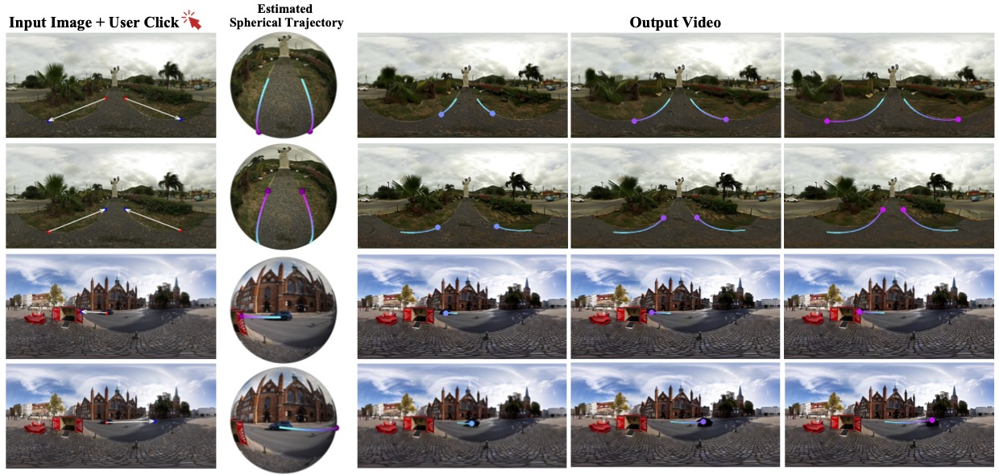

# OmniDrag
<div align="center">
<h3>
[IJCV 2025] OmniDrag: Enabling Motion Control for Omnidirectional Image-to-Video Generation
</h3>


[](https://arxiv.org/pdf/2412.09623)
[](https://lwq20020127.github.io/OmniDrag/)


[Weiqi Li](https://scholar.google.com/citations?user=SIkQdEsAAAAJ), Shijie Zhao, Chong Mou, Xuhan Sheng, Zhenyu Zhang, Qian Wang, Junlin Li, Li Zhang and [Jian Zhang](https://jianzhang.tech/)

*School of Electronic and Computer Engineering, Peking University*

*ByteDance Inc.*
</div>

## 🔥 Introduction
Omnidirectional videos generated by proposed OmniDrag. It enables drag-style synthesis from a reference omnidirectional
image and user-specified points, providing both scene-level (top) and object-level (bottom) accurate, high-quality controllable generation.

<p align="center">
  
</p>

## ✏️ To Do List
- [ ] Release the Move360 dataset.
- [ ] Release the inference code and weights.
- [ ] Release the training code.
- [x] Release the paper.

## Citation
If you find the code helpful in your research or work, please cite the following paper:
```
@article{li2024omnidrag,
  title={OmniDrag: Enabling Motion Control for Omnidirectional Image-to-Video Generation},
  author={Li, Weiqi and Zhao, Shijie and Mou, Chong and Sheng, Xuhan and Zhang, Zhenyu and Wang, Qian and Li, Junlin and Zhang, Li and Zhang, Jian},
  journal={International Journal of Computer Vision(IJCV)},
  year={2025}
}
```
